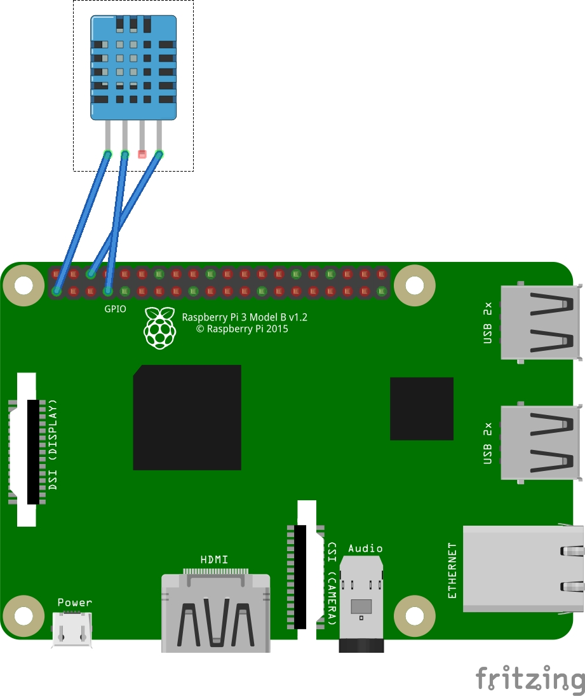

# workshop_dht11
Material for raspberry pi workshop

# Code

Copy and execute inside your raspberry the file "bin/arm6/dht11" if you're using raspberryi pi zero

And for raspberryi pi 3 "bin/arm7/dht11"

# Ressources
[Workshop Temperature and Humidty](https://github.com/opendevices/iot.apps/tree/master/workshop-temperature-humidty-dht11-dht22)

[https://tutorials-raspberrypi.com/raspberry-pi-measure-humidity-temperature-dht11-dht22/](https://tutorials-raspberrypi.com/raspberry-pi-measure-humidity-temperature-dht11-dht22/)

